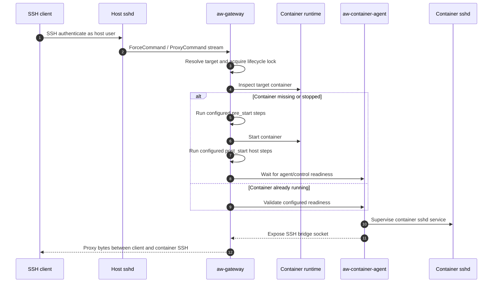
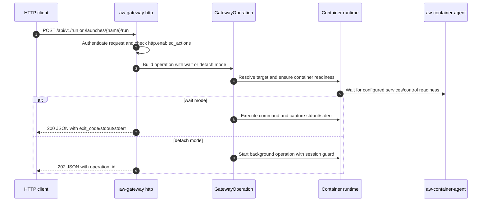
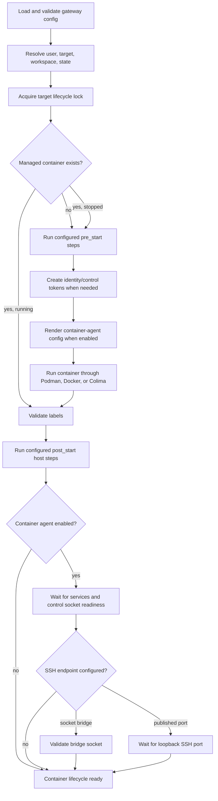
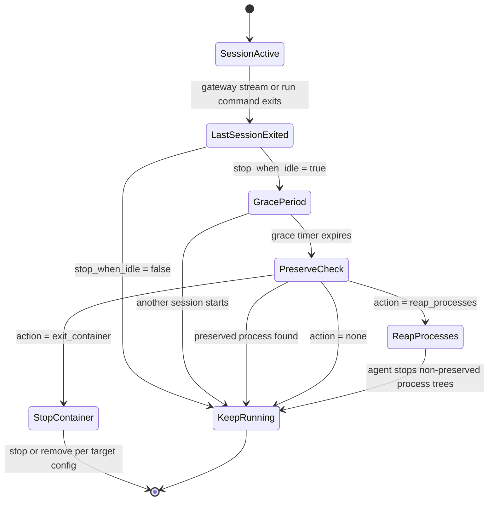
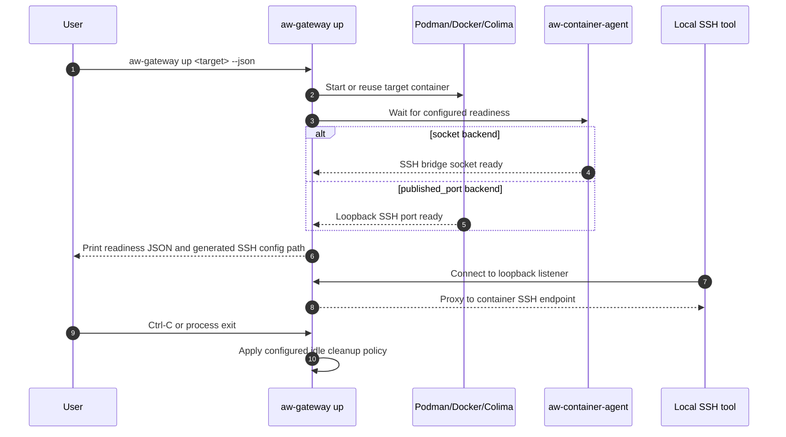

# Agent Workspaces Gateway

`aw-gateway` is a gateway for disposable or reusable container workspaces. It
starts or reuses configured containers, supervises required in-container
services, and exposes workspace operations through the host CLI,
SSH-compatible clients, and an optional JSON HTTP API. Users can work normally
inside the workspace, while operators keep the host filesystem out of reach and
attach policy hooks around the container, especially at the container network
layer.

SSH remains the standard interactive attach path: OpenSSH, SCP, SFTP, and
desktop tools connect to container-local SSH instead of to the host shell or
host filesystem. The CLI and HTTP API expose the same managed lifecycle and
operation model for automation and non-interactive integrations.

It is a standalone gateway for managed hosts and local workstation profiles
that use Podman, Docker, or Colima.

In this project, a target is a named container configuration: an image plus
its naming mode, identity, cleanup policy, and SSH settings. "Agent
Workspaces" is the descriptive name for these sandboxes; the `aw-` binaries
implement the gateway and in-container support processes.

## Why It Exists

The goal is to let development tools run with normal local freedom inside a
container while moving the security boundary to the sandbox edges. Site policy
can be expressed through configured lifecycle hooks, mounted bootstrap assets,
supervised services, and host or container network controls without hard-coding
those policies into the gateway binary.

This matters when code or tools running in the workspace are not fully trusted,
such as autonomous coding agents or untrusted build steps, and should feel like
a normal development box without reaching the host filesystem or unrestricted
network.

Standard development tools still need a familiar interactive connection model.
OpenSSH, SCP, SFTP, and desktop tools like VS Code, Codex, and Claude Code all
know how to talk SSH, so `aw-gateway` provides an SSH bridge into the sandbox.
Automation needs a stable control surface too, so the same gateway operations
are available from the host CLI and, when enabled, the JSON HTTP API. On
managed hosts, host SSHD authenticates the user and starts `aw-gateway`; the
gateway prepares the target container, waits for required services, and
connects the client to the container-local SSH daemon through a controlled
bridge.

## Features

- Host-side CLI for target lifecycle, status, launches, run commands, and
  client configuration.
- SSH-compatible attach for interactive shells, direct commands, SCP, SFTP,
  and gateway management actions.
- Optional JSON HTTP API for status, targets, readiness, launch, and run
  automation.
- Container lifecycle management for fixed and ephemeral targets.
- Runtime support for Podman, Docker, and Colima.
- Config-driven lifecycle steps before container start and host steps after
  start, including health checks.
- Named launches for validated, discoverable command templates that prepare a
  ready target and then run a final in-container command.
- In-container service supervision with dependency ordering, restart policy,
  service health checks, and graceful shutdown.
- Built-in Unix-socket bridge from short runtime socket directories to
  container SSH.
- Generated SSH client configuration for SSH, SCP, and SFTP clients.
- Per-user default target selection.
- First-run identity-token generation and controlled forwarding to selected
  services.
- Optional idle cleanup that can stop a container or reap non-preserved
  processes after the last gateway session exits.
- Protocol-safe logging for proxy modes and rotating JSON logs for
  diagnostics.

## Lifecycle Diagrams

The user-facing ingress paths differ, but they converge on the same target
resolution, readiness, operation execution, and cleanup machinery.

### Managed SSH Attach

In managed-server mode, host SSH authenticates the user and then invokes the
gateway. The user's SSH client is ultimately connected to container-local SSH,
not to the host shell or host filesystem.



### HTTP API Operation

The HTTP API is a non-interactive JSON ingress path into the same gateway
operation layer used by CLI and SSH management actions.



### Container Startup And Readiness

Custom deployment hooks are represented as configured lifecycle/host steps.
They can prepare storage, create workspaces, install firewall rules, or perform
site-specific setup, but the native gateway lifecycle remains the same.



### Session Exit, Grace Period, And Cleanup

Cleanup is target policy. A target can keep running, stop after the last
session, ask the container agent to reap non-preserved processes, and for
ephemeral target-specific workspaces optionally remove the resolved session
workspace. Preserve processes such as `tmux` or `screen` can keep a container
alive when configured.



### Local Workstation Listen Mode

Local mode does not require host SSHD. The gateway can start a target and bind a
loopback-only listener for local SSH-compatible tools. Docker and Colima can use
a published loopback container SSH port instead of a host-visible Unix socket.



## Binaries

This repository builds four binaries:

- `aw-gateway`: host-side CLI, SSH dispatcher, optional HTTP API daemon,
  runtime lifecycle manager, and client-config generator.
- `aw-container-bootstrap`: optional in-container bootstrap entrypoint that
  prepares identity/state and then execs the agent.
- `aw-container-agent`: container-side supervisor, control socket, service
  manager, idle-cleanup agent, and SSH socket bridge.
- `aw-ssh-command-filter`: container-side SSHD `ForceCommand` helper used to
  enforce configurable legacy SCP policy without breaking shell command exec.

## Build

Run build and install commands from the cloned repository root. Building
requires a Rust toolchain with edition 2024 support, which means rustc 1.85 or
newer. Container-side binaries must be built for the Linux architecture used by
the target container.

```bash
cargo build --release
```

The binaries are:

```text
target/release/aw-gateway
target/release/aw-container-bootstrap
target/release/aw-container-agent
target/release/aw-ssh-command-filter
```

For managed deployments, `aw-gateway` is installed on the host.
Container-side binaries can either be installed in the target image or mounted
read-only through the bootstrap-mount mode.

Example host install:

```bash
sudo install -m 0755 target/release/aw-gateway /opt/aw-gateway/bin/aw-gateway
```

Example container-runtime artifact install:

```bash
install -m 0755 target/release/aw-container-bootstrap /opt/aw-gateway/runtime/linux/aw-container-bootstrap
install -m 0755 target/release/aw-container-agent /opt/aw-gateway/runtime/linux/aw-container-agent
install -m 0755 target/release/aw-ssh-command-filter /opt/aw-gateway/runtime/linux/aw-ssh-command-filter
```

## Configuration

Gateway config lookup uses this precedence:

1. `--config PATH`
2. `AW_GATEWAY_CONFIG`
3. User config file, when present:
   `{AW_GATEWAY_CONFIG_HOME|XDG_CONFIG_HOME|~/.config}/aw-gateway/gateway.toml`
4. System config file, when present: `/etc/aw-gateway/gateway.toml`

The container-agent and bootstrap configs remain explicit/system-managed:

```text
/etc/aw-gateway/container-agent.toml
/etc/aw-gateway/container-bootstrap.toml
```

Validate configs:

```bash
aw-gateway --config /tmp/gateway.toml config validate
aw-container-agent --config /tmp/container-agent.toml config validate
```

Show resolved gateway config paths:

```bash
aw-gateway config paths
aw-gateway config paths --json
```

Config path and log level can be overridden with flags or environment
variables:

```text
AW_GATEWAY_CONFIG
AW_GATEWAY_CONFIG_HOME
AW_GATEWAY_STATE_HOME
AW_GATEWAY_LOG_LEVEL
AW_CONTAINER_AGENT_CONFIG
AW_CONTAINER_AGENT_LOG_LEVEL
AW_CONTAINER_BOOTSTRAP_CONFIG
```

`AW_GATEWAY_CONFIG` selects an explicit host gateway config. `AW_GATEWAY_CONFIG_HOME`
and `AW_GATEWAY_STATE_HOME` override the user config and state roots.
`AW_CONTAINER_AGENT_CONFIG` selects the in-container supervisor config, and
`AW_CONTAINER_BOOTSTRAP_CONFIG` selects the rendered bootstrap config consumed
by `aw-container-bootstrap`.

The minimal gateway syntax sample and canonical agent sample are:

```text
aw-gateway.sample.toml
container-agent.sample.toml
```

For working platform deployments, start from the guide and example config for
Podman, Docker, or Colima instead of copying the minimal gateway sample.

## HTTP API

`aw-gateway http` starts a JSON HTTP listener from the gateway config. The
daemon starts only when `[http].enabled = true`; otherwise it exits nonzero
with `http listener is disabled in config`. The listener address is a single
socket string such as `127.0.0.1:8080` or `[::1]:8080`.

```toml
[http]
enabled = true
listen = "127.0.0.1:8080"
enabled_actions = ["status", "targets", "launches", "launch", "up", "run"]

[http.auth]
type = "none"
```

When `auth.type = "none"`, no `Authorization` header is required. Bind to
loopback or put the daemon behind an external auth boundary. Bearer auth reads
the configured token and requires `Authorization: Bearer <token>` on every
`/api/v1/*` route. The HTTP listener does not terminate TLS; use loopback or a
TLS-terminating reverse proxy for bearer auth.

```toml
[http.auth]
type = "bearer"
token = "change-me"
```

`http.enabled_actions` is an HTTP-specific allow list. Supported values are
exactly `status`, `targets`, `launches`, `launch`, `up`, and `run`. Other
gateway actions such as `connect`, `stop`, `remove`, key management,
client-config/bundle, proxy/tunnel helpers, and default-target management are
not HTTP API actions.

Every success response is JSON. Metadata endpoints return:

```json
{"ok": true, "data": {}}
```

Wait-mode command and launch responses return HTTP 200 even when the command
exit code is nonzero:

```json
{"ok": true, "mode": "wait", "exit_code": 0, "stdout": "...", "stderr": "..."}
```

Detach-mode command and launch responses return HTTP 202:

```json
{"ok": true, "mode": "detach", "status": "accepted", "operation_id": "abc123"}
```

There is no query-later result endpoint for detached operations. Detached
operations run in the background through the same gateway operation layer and
are observable only through existing lifecycle/status side effects.

Errors use a stable envelope:

```json
{"ok": false, "error": {"code": "invalid_request", "message": "human-readable message"}}
```

| Method | Path | Action | Operation |
| --- | --- | --- | --- |
| `GET` | `/api/v1/status?target=default&session_id=abc` | `status` | `GatewayOperation::Status` |
| `GET` | `/api/v1/status/all` | `status` | `GatewayOperation::StatusAll` |
| `GET` | `/api/v1/targets` | `targets` | `GatewayOperation::Targets` |
| `POST` | `/api/v1/up` | `up` | `GatewayOperation::Up` |
| `GET` | `/api/v1/launches` | `launches` | `GatewayOperation::Launches` |
| `GET` | `/api/v1/launches/{name}` | `launch` | `GatewayOperation::LaunchShow` |
| `POST` | `/api/v1/launches/{name}/run` | `launch` | `GatewayOperation::Launch` |
| `POST` | `/api/v1/run` | `run` | `GatewayOperation::Run` |

Command-like POST bodies accept optional `mode` and `output` fields. `mode`
defaults to `wait` and can be `wait` or `detach`; HTTP does not expose stream
mode. `output` defaults to `["stdout", "stderr"]`, accepts only `stdout` and
`stderr`, and applies only to wait responses.

```json
{
  "target": "default",
  "session_id": "optional",
  "cwd": "~/workspace",
  "command": ["bash", "-lc", "echo hello"],
  "mode": "wait",
  "output": ["stdout", "stderr"]
}
```

Launch run requests accept typed JSON variables. Strings, booleans, integers,
and finite numbers are passed to launch validation; nulls, arrays, objects,
duplicate keys, unknown vars, missing required vars, enum/range/type failures,
and non-finite numbers are rejected as `invalid_launch_var`.

```json
{
  "session_id": "optional",
  "vars": {
    "repo": "https://example.test/repo.git",
    "debug": true,
    "count": 3,
    "mode": "safe"
  },
  "mode": "wait",
  "output": ["stdout", "stderr"]
}
```

The initial HTTP API intentionally does not implement streaming, SSE/NDJSON,
persistent jobs, TTY sessions, SSH key management, generated client config or
bundles, proxy/tunnel helpers, stop/remove, default-target management, route
aliases, or retired config-shape compatibility.

## Deployment Guides

- [Podman](docs/guides/podman.md): generic local workstation and remote SSH
  deployment patterns with a minimal Ubuntu image and copyable example configs.
- [Docker](docs/guides/docker.md): native Linux Docker local and remote SSH
  deployment patterns.
- [Colima](docs/guides/colima.md): macOS local Colima deployment pattern using
  Docker through a Colima profile.
- [Firewall Policy](docs/guides/firewall.md): optional host, container, or VM
  firewall hooks for egress control.
- [Proxy And CA Policy](docs/guides/proxy.md): optional proxy service, CA trust,
  session environment, and firewall redirect patterns.
- [Smoke Test Harness](docs/guides/smoke.md): opt-in live tests for remote
  Docker, rootless Podman, and Colima hosts.

## Gateway Config Shape

The gateway config defines the runtime, workspace paths, SSH dispatch behavior,
client config generation, container targets, host lifecycle steps, and embedded
container-agent policy.

Minimal runtime selection:

```toml
[runtime]
type = "podman" # podman, docker, or colima
```

Docker can use a specific Docker socket:

```toml
[runtime]
type = "docker"
docker_host = "unix:///var/run/docker.sock"
```

Colima is implemented through Docker and derives `DOCKER_HOST` from the Colima
profile:

```toml
[runtime]
type = "colima"
profile = "default"
```

Set `runtime.program` to use a specific runtime executable instead of looking
up the default `podman`, `docker`, or `colima` binary on `PATH`:

```toml
[runtime]
type = "podman"
program = "/usr/local/bin/podman"
```

Target example:

```toml
[targets.ubuntu-dev]
image = "ubuntu/dev"
mode = "fixed"
name = "{image_slug}"
stop_when_idle = true
remove_on_stop = false
```

Fixed targets reuse one named container across connections. Ephemeral targets
create a per-session container and require `mode = "ephemeral"`,
`ephemeral_name` with `{session_id}`, and `stop_when_idle = true` so idle
cleanup can remove each session container.

Ephemeral targets can also opt into target workspace cleanup:

```toml
[targets.worker]
image = "ubuntu/dev"
mode = "ephemeral"
ephemeral_name = "worker-{session_id}"
stop_when_idle = true

[targets.worker.workspace]
path = "{home}/.cache/aw-gateway/workspaces/{target}-{session_id}"
cleanup = "always"

[targets.worker.idle_cleanup]
owner = "gateway"
action = "exit_container"
```

`workspace.cleanup` accepts `never` (the default), `success`, or `always`.
Cleanup is supported only for ephemeral targets with a target-specific
`workspace.path` under an `aw-gateway` path component that references
`{session_id}`. Cleanup also requires gateway-owned `exit_container` idle
cleanup with no `preserve_processes`, so the session workspace is not deleted
while the container is intentionally still alive. The gateway deletes only the
resolved workspace for that session after the session is done and after
container cleanup has completed or been attempted. Missing workspaces are
treated as success; cleanup failures are warnings and do not replace the
command or launch exit status. Unsafe deletion roots are refused before the
session runs (empty paths, `/`, the user home directory, paths missing the
current session id) and again before deletion (symlink roots). Control socket
runtime directories are managed by `[target_defaults.control_sockets]` or
`[targets.<name>.control_sockets]`, not by workspace
cleanup. Non-listen `up` remains a warm-up operation and does not trigger
workspace cleanup.

Podman managed-host targets default to the authenticated host user and home.
Docker and Colima targets default to `root` and `/root`; set
`container_user` and `container_home` when the image provides a different
account.

Target identity controls the user and numeric identity prepared inside the
container:

```toml
[targets.ubuntu-dev.identity]
bootstrap_user = "root"
session_user = "{user}"
session_uid = "{uid}"
session_gid = "{gid}"
session_home = "/home/{user}"
session_shell = "/bin/bash"
```

Gateway configs commonly include:

- `[target_defaults]`: partial target-shaped defaults inherited by every
  target.
- `[target_templates.<name>]`: reusable partial target-shaped templates that
  targets opt into with ordered `use = [...]`.
- `[target_defaults.workspace]`: default host workspace path, state directory,
  and cleanup policy.
- `[target_defaults.control_sockets]`: short runtime directories for gateway-managed Unix
  sockets. Durable config, logs, state, and session metadata remain under the
  workspace state directory.
- `[ssh_dispatch]`: which host SSH commands are handled by the gateway and
  whether container command passthrough is enabled.
- `[http]`: optional JSON HTTP daemon listener, auth mode, and HTTP action
  allow list.
- `[client_config]`: generated SSH alias templates, host name, gateway path,
  and default identity directory.
- `[targets.<name>]`: container image, naming mode, container user/home,
  idle and workspace cleanup behavior, optional runtime args, environment, and
  local-listen settings.
- `[targets.<name>.identity]`: container bootstrap and session identity
  fields.
- `[[target_defaults.lifecycle_steps]]`: phase-keyed host hooks for `pre_start`,
  `post_start_host`, `pre_stop`, and `post_stop`, with per-step command
  timeouts.
- `[[target_defaults.host_steps]]`: post-start host hooks that run after agent readiness, such
  as firewall setup, with per-step command timeouts and optional command health
  checks.
- `[launches.<name>]`: named command templates that select a target, validate
  caller variables, optionally run post-ready setup steps, and execute a final
  command inside the ready container.
- `[launch_templates.<name>]`: reusable partial launch-shaped templates that
  launches opt into with ordered `use = [...]`.
- `includes`: strict include globs for splitting target templates, launch
  templates, targets, and launches into separate TOML files.
- `extends`: root config inheritance for layering a selected config over a
  managed base config.
- `[[target_defaults.container_mounts]]` and `[[targets.<name>.container_mounts]]`: extra
  host-to-container bind mounts, typically read-only bootstrap
  binaries/configs/certs.
- `[target_defaults.container_bootstrap]`: optional bootstrap entrypoint configuration and
  pre-agent container bootstrap steps. Targets may overlay
  `[targets.<name>.container_bootstrap]` field-by-field.
- `[[target_defaults.container_bootstrap_steps]]`: optional container-side setup commands that
  run after identity preparation and before the agent starts. Targets may
  replace, remove, append, or order steps with
  `[[targets.<name>.container_bootstrap_steps]]`.
- `[target_defaults.container_ssh.transfer]`: explicit container SSH file-transfer policy.
  Set `sftp = "deny"` to block SFTP and modern OpenSSH SCP. Set
  `legacy_scp = "deny"`, `"inbound"`, or `"outbound"` to control legacy
  `scp -t`/`scp -f` server mode through the container-side command filter.
  A target may overlay individual transfer fields with
  `[targets.<name>.container_ssh.transfer]`.
- `[target_defaults.container_agent]`: optional in-container supervision and SSH bridge
  support.
- `[[target_defaults.container_agent.services]]`: in-container services supervised by
  `aw-container-agent`.
- `[target_defaults.container_agent.ssh_bridge]`: Unix socket bridge to container SSH. In
  gateway config, the socket path is generated from target control sockets.

By default, gateway-managed sockets use a short per-runtime host directory and
a stable in-container mount point:

```toml
[target_defaults.control_sockets]
host_dir = "/run/user/{uid}/aw-gateway/{runtime_id}"
container_dir = "/run/aw-gateway"
```

Fixed targets use the target id as `{runtime_id}`. Ephemeral targets use the
session id. Target-specific overrides are available for unusual runtimes:

```toml
[targets.code-review.control_sockets]
container_dir = "/tmp/aw-gateway"
```

The gateway creates the rendered host directory with private permissions before
container startup, bind-mounts it into the container, and removes the leaf
runtime directory during stop/remove cleanup. If the default `/run/user/{uid}`
directory is unavailable or not writable, configure
`target_defaults.control_sockets.host_dir` to another short absolute path under
`[target_defaults.control_sockets]` or
`[targets.<name>.control_sockets]`.

For macOS/Colima, use a user-owned path because macOS does not normally provide
`/run/user/{uid}`:

```toml
[target_defaults.control_sockets]
host_dir = "/Users/alice/.cache/aw-gateway/sockets/{runtime_id}"
container_dir = "/run/aw-gateway"
```

Target-specific runtime and environment knobs are explicit:

```toml
[targets.default.runtime]
extra_run_args = ["--cap-add", "SYS_ADMIN"]

[targets.default.container_env]
CODEX_HOME = "/var/lib/codex"

[targets.default.session_env]
CODEX_HOME = "/var/lib/codex"
```

`container_env` is passed when the long-lived container is created.
`session_env` is used for gateway-managed command execution and is rendered
into the generated SSHD session environment snippet consumed by the example
container SSH helper.

Container SSH transfer policy is independent for SFTP and legacy SCP:

```toml
[target_defaults.container_ssh.transfer]
sftp = "allow"        # allow | deny
legacy_scp = "allow"  # allow | deny | inbound | outbound
```

Target transfer policy overlays the default transfer table field-by-field, so
set only the fields that differ for that target:

```toml
[targets.internal.container_ssh.transfer]
sftp = "deny"
legacy_scp = "outbound"
```

Default lifecycle, host, and bootstrap step lists are inherited by every target.
Target entries use the same key as the default list (`phase + name` for
`lifecycle_steps`, `name` for `host_steps` and `container_bootstrap_steps`).
A same-key target entry replaces the inherited entry in place, while
`enabled = false` removes an inherited entry. New target-only entries append by
default and can specify one of `before = "name"` or `after = "name"`; lifecycle
ordering references are resolved only within the same phase.
As a convenience, a target lifecycle or host step entry that sets only
`timeout` inherits the missing fields from the matching default entry; any other
partial override must include the full replacement payload.

Use `lifecycle_steps` for host hooks tied to a lifecycle phase, including stop
and teardown phases. Use `host_steps` for post-start checks and setup that
should run after the container agent is ready and can report readiness.
Lifecycle and host hook commands use `timeout = "60s"` by default. Set a larger
per-step `timeout` when a hook legitimately needs more time. The timeout uses
the same explicit units as other durations: `ms`, `s`, `m`, or `h`. Timed-out
required hooks fail the operation after the child process is killed and reaped;
timed-out optional hooks warn and continue. `host_steps.health_check` timeouts
are separate from the host step command timeout.

```toml
[[target_defaults.lifecycle_steps]]
phase = "pre_start"
name = "ensure-workspace"
required = true
timeout = "60s"
command = ["/usr/bin/mkdir", "-p", "{workspace}"]

[[target_defaults.host_steps]]
name = "network-policy"
required = true
timeout = "30s"
command = ["/opt/site-policy/bin/network-policy", "add", "{container_pid}"]

[target_defaults.host_steps.health_check]
type = "command"
command = ["/opt/site-policy/bin/network-policy", "check", "{container_pid}"]
```

Common target behavior can also be factored into named
`[target_templates.<name>]` sections. Templates use the same partial target
shape as `[target_defaults]` and `[targets.<name>]`. A target opts in with
ordered `use = [...]`; effective target order is `[target_defaults]`, then each
named template in order, then the concrete target. Templates may use other
target templates, and cycles or unknown template names fail config validation.

```toml
[target_templates.rocky-runtime]
image = "rocky8/base"
container_user = "worker"
container_home = "/home/worker"

[target_templates.review-ephemeral]
mode = "ephemeral"
ephemeral_name = "review-{session_id}"
stop_when_idle = true

[target_templates.review-ephemeral.idle_cleanup]
owner = "gateway"
action = "exit_container"

[target_templates.rocky-review]
use = ["rocky-runtime", "review-ephemeral"]
image = "rocky8/review"

[targets.code-review-worker]
use = ["rocky-review"]
image = "rocky8/review-sip"

[targets.code-review-worker.workspace]
path = "{home}/.cache/aw-gateway/workspaces/{target}-{session_id}"
cleanup = "always"
```

## Launches

Launches are stateless, configured command templates. They do not add a job
history or background launch manager. A launch selects an existing target,
validates typed caller variables, starts or reuses the target through the
normal readiness path, runs optional `post_ready` steps, then executes the
final command inside the ready container.

Caller variables are referenced only as `{var.<name>}`. Built-ins such as
`{workspace}`, `{container_home}`, `{session_id}`, `{target}`, and
`{container_name}` remain unprefixed. Unknown variables fail config
validation, and unprefixed caller variables such as `{repo}` are rejected.

```toml
[launches.repo-shell]
target = "default"
description = "Clone a repository and open a shell."
cwd = "{container_home}/repo"
env = { REPO_URL = "{var.repo}" }
command = ["/bin/bash", "-lc", "exec /bin/bash"]

[launches.repo-shell.vars]
repo = { type = "string", required = true, description = "Git repository URL" }
branch = { type = "string", default = "main" }
mode = { type = "enum", values = ["fast", "safe"], default = "safe" }
debug = { type = "boolean", default = false }
limit = { type = "number", default = 1 }

[[launches.repo-shell.steps]]
phase = "post_ready"
location = "container"
name = "clone"
required = true
timeout = "5m"
cwd = "{container_home}"
command = ["git", "clone", "--branch", "{var.branch}", "--single-branch", "{var.repo}", "repo"]
```

Common launch behavior can be factored into `[launch_defaults]`. Defaults use
the same partial launch shape as concrete launches: scalar fields such as
`target`, `cwd`, `description`, and `command` are replaced by a concrete
launch, `env` and `vars` merge by key, and `steps` merge by `name`.

```toml
[launch_defaults]
target = "default"
cwd = "{container_home}"
env = { CODEX_HOME = "{container_home}/.codex" }

[launch_defaults.vars]
repo = { type = "string", required = true, description = "Git repository URL" }

[[launch_defaults.steps]]
phase = "post_ready"
location = "container"
name = "prepare"
command = ["mkdir", "-p", "{container_home}/repo"]

[launches.repo-shell]
description = "Clone a repository and open a shell."
cwd = "{container_home}/repo"
command = ["/bin/bash", "-lc", "exec /bin/bash"]
```

Named launch templates provide additional reusable partial launch layers.
Launches opt in with ordered `use = [...]`; effective launch order is
`[launch_defaults]`, then each named launch template in order, then the
concrete launch. Launch templates may use other launch templates, and cycles or
unknown template names fail config validation. A launch `command` always
replaces the earlier command; command fragments are not composed.

```toml
[launch_templates.repo-review]
target = "default"
cwd = "{container_home}/repo"

[launch_templates.repo-review.vars]
repo = { type = "string", required = true, description = "Git repository URL" }

[launch_templates.codex-review]
use = ["repo-review"]
env = { CODEX_HOME = "{container_home}/.codex" }
command = ["codex", "exec", "{var.repo}"]

[launches.code-review]
use = ["codex-review"]
description = "Run a Codex review."
command = ["codex", "exec", "review", "{var.repo}"]
```

Supported variable types are `string`, `enum`, `boolean`, and `number`.
Boolean CLI values must be `true` or `false`; number values must parse as
finite numbers; enum values must exactly match the configured `values`.
Optional variables referenced by templates must define a default.

Launch commands:

```bash
aw-gateway launches
aw-gateway launches --json
aw-gateway launch show repo-shell
aw-gateway launch show repo-shell --json
aw-gateway launch repo-shell --var repo=https://example.test/repo.git --var branch=main
aw-gateway launch repo-shell --session-id abc123def456 --var repo=https://example.test/repo.git
```

When `launches` and `launch` are present in
`ssh_dispatch.enabled_actions`, the same commands can be invoked
through the host SSH gateway:

```bash
ssh host launches
ssh host 'launch show repo-shell --json'
ssh host 'launch repo-shell --var repo=https://example.test/repo.git --var branch=main'
ssh host 'launch repo-shell --session-id=abc123def456 --var=repo=https://example.test/repo.git'
```

Omit `launch` from `ssh_dispatch.enabled_actions` if SSH users should
not start configured launch workflows. Omit `launches` if SSH users should not
list configured launches.

`launches --json` emits a bare array of launch summaries. Each summary includes
`name`, `target`, optional `description`, and a `vars` object keyed by variable
name with `type`, `required`, optional `default`, optional enum `values`, and
optional `description`. `launch show --json` emits one detail object with the
same variable metadata plus `steps`, optional final `cwd`, optional final
`env`, and final `command`.

Launch execution order is:

1. Load, include, and validate config.
2. Resolve the named launch.
3. Validate supplied `--var key=value` values and apply defaults.
4. Resolve and prepare the configured target.
5. Run the existing target lifecycle, readiness checks, and target
   `host_steps`.
6. Run launch `post_ready` steps in TOML order.
7. Execute the final command inside the ready container.
8. Drop the session marker and run normal gateway-owned cleanup.

Container launch step environment is target session env, then rendered launch
env, then rendered step env, with later values overriding earlier. The final
command receives target session env plus rendered launch env. Host launch step
env is exactly the rendered step env.

Launch provenance is intentionally minimal. Session markers, status JSON, and
newly created ephemeral session container labels store only the launch name as
`launch`; resolved variables, argv, env, repository URLs, and branch names are
not persisted. Fixed/reused containers do not persist launch labels because the
container can outlive any one launch session.
`aw-gateway status <target> --json` and `aw-gateway status --all --json`
include nullable `launch` fields. Text `status <target>` prints
`launch: <name>` only when present, and `status --all` includes a compact
`LAUNCH` column.

Target and launch definitions can be split into strict include files:

```toml
includes = ["/etc/aw-gateway/config.d/*.toml"]
```

Include glob matches are sorted lexicographically before composition. Includes
are resolved relative to the file that declares them, may be nested, and reject
cycles, duplicate target/template or launch/template names, unknown fields, and
partial object merge or override behavior. Include files may define nested
`includes`, `[target_templates.<name>]`, `[launch_templates.<name>]`,
`[targets.<name>]`, and `[launches.<name>]`.

Gateway-wide policy and defaults remain root-owned. Include files must not
define `schema_version`, `default_target`, `[runtime]`, `[logging]`,
`[http]`, `[ssh_dispatch]`, `[client_config]`, `[target_defaults]`, or
`[launch_defaults]`.

Root configs may inherit another root config with `extends`:

```toml
extends = "/etc/aw-gateway/gateway.toml"
```

`extends` is honored only by the selected root config. Unlike include files, an
extended root may define root-owned policy, defaults, templates, targets, and
launches. The loader composes each file's own `includes` relative to that file,
strips loader-only `extends` and `includes`, then merges base-to-child before
normal validation.

Root inheritance uses these merge rules:

- Tables merge by key, except each service `env.<NAME>` value replaces the
  inherited value as a whole.
- Scalars and ordinary arrays replace the inherited value. This includes
  `container_mounts`, runtime argument arrays, command arrays, dependency
  arrays, allow-list arrays, and launch variable value arrays.
- Named service arrays merge by `name` at `target_defaults.container_agent.services`,
  `target_templates.<name>.container_agent.services`, and
  `targets.<name>.container_agent.services`.
- Named step arrays merge by `name` for target lifecycle, host, and container
  bootstrap steps, and for launch `steps` in launch defaults, templates, and
  launches.

Named arrays preserve inherited order and append new child entries. Step patch
controls such as `enabled = false`, `before`, and `after` are not deletion or
reorder operations across `extends`; after root inheritance, the merged step must
still pass normal validation. Use target or launch template overlays when a
target or launch needs to remove or reorder inherited steps.

When `sftp = "deny"`, `start-container-sshd` removes the SFTP subsystem from
the runtime SSHD config. Modern OpenSSH SCP uses SFTP, so that blocks both.
When `legacy_scp` is not `"allow"`, the helper adds a container-side
`ForceCommand` that runs `aw-ssh-command-filter`. Legacy SCP inbound means
upload into the container (`scp -t`); outbound means download from the
container (`scp -f`). SFTP has only allow/deny because the SFTP subsystem is a
bidirectional protocol channel rather than separate upload/download server
commands.

`target_defaults.container_ssh.transfer` only applies to traffic that
traverses the container SSHD. Gateway actions such as `run` execute through the
host container runtime, so they do not pass through the container SSHD
`ForceCommand` and are not controlled by SFTP/SCP transfer policy.
Host-gateway SSH dispatch checks the default transfer table before dispatch;
per-target transfer overrides do not relax that host-side gate and only affect
direct container-SSHD access. If a deployment intends to expose management-only
SSH commands without arbitrary container exec, omit `run` from
`ssh_dispatch.enabled_actions`; omit `launch` if users should not start
configured launch workflows; omit `launches` if users should not discover
configured launches; also omit `connect` if users should not receive a full
container SSH session. `allow_container_commands = false` blocks non-gateway
passthrough commands, but it does not disable explicitly enabled gateway
actions.

## Container Agent Services

When `target_defaults.container_agent.enabled = true` or an effective target
enables the agent, the gateway renders the effective container-agent policy
into the container state directory. By default it
starts `aw-container-agent` as the container entrypoint. If
`target_defaults.container_bootstrap.enabled = true` or an effective target
enables bootstrap, it starts `aw-container-bootstrap`
instead; bootstrap prepares passwd/group/home/state, runs configured bootstrap
steps, and then execs `aw-container-agent` so the agent becomes PID 1. When the
agent is disabled, the gateway can still manage container lifecycle and
`run/status/stop`, but SSH proxying and supervised services are unavailable
unless the target uses a separate configured mechanism.

The container agent supervises configured services, exposes the SSH bridge, and
answers gateway control requests over a private Unix-domain control socket.
Disabling the control socket is useful for published-port SSH backends, but it
also removes agent-control readiness and mutating control requests through that
socket.
Gateway-managed control and SSH bridge sockets live under target control socket
config, not under durable workspace state. Before starting a container, the gateway
checks the resolved host and in-container Unix socket paths and fails fast if
any path exceeds the platform socket path limit.

Service example:

```toml
[[target_defaults.container_agent.services]]
name = "container-sshd"
required = true
user = "root"
command = ["/usr/local/bin/start-container-sshd"]
restart = "always"
depends_on = ["acl-proxy"]

[target_defaults.container_agent.services.health_check]
type = "tcp"
host = "127.0.0.1"
port = 22
interval = "2s"
timeout = "1s"
```

Supported service health checks include process, TCP, and HTTP checks. HTTP
checks can require status codes and top-level JSON field matches.

Services do not inherit sensitive gateway environment by default. A service
receives values such as `AW_IDENTITY_TOKEN` only when explicitly configured in
the service `env` table:

```toml
[target_defaults.container_agent.services.env]
AW_IDENTITY_TOKEN = { inherit = "AW_IDENTITY_TOKEN" }
STATIC_VALUE = { value = "example" }
FROM_FILE = { file = "/run/secrets/example", required = false }
```

Service env entries can use literal `value`, inherit from the agent
environment, or read a file.

## SSH Workflows

On a managed host, OpenSSH authenticates the user and invokes `aw-gateway` with
`ForceCommand`. The user's normal login shell should remain a standard shell
such as `/bin/bash`; the gateway handles command dispatch.

`ForceCommand` makes host SSHD run the gateway instead of the user's shell for
matched accounts. SSHD passes the requested command in `SSH_ORIGINAL_COMMAND`,
which the gateway parses as a management action or container command.
Generated client config uses `ProxyCommand` so workstation SSH tools can
tunnel through the authenticated host connection to container SSH.

Example SSHD match block:

```sshconfig
Match Group aw-gateway-users
    ForceCommand /opt/aw-gateway/bin/aw-gateway --config /etc/aw-gateway/gateway.toml
    PermitTTY yes
    AllowTcpForwarding no
    AllowStreamLocalForwarding no
    PermitTunnel no
    X11Forwarding no
    AllowAgentForwarding no
```

Managed SSH deployments should pass an explicit system config path when
per-user overrides are not intended. Unrestricted users running `aw-gateway`
directly can use their own default config at
`~/.config/aw-gateway/gateway.toml`.

Typical user actions through host SSH:

```bash
ssh user@host
ssh user@host status
ssh user@host set-default fedora-dev
ssh user@host show-default
ssh user@host reset-default
ssh user@host stop
ssh user@host remove internal-ubuntu-dev
ssh user@host rm internal-ubuntu-dev
ssh user@host 'git status'
```

For direct SSH/SCP/SFTP/VS Code access to the container SSH daemon, generate
client config:

```bash
cat ~/.ssh/id_rsa.pub | ssh user@host 'add-container-key ubuntu-dev --public-key -'
ssh user@host 'client-config ubuntu-dev'
```

The first command appends the workstation public key to the container
authorized-key file under workspace state. The second prints SSH config for the
container route. The generated config intentionally omits `User` and
`IdentityFile`; keep those in your normal local SSH config when needed.
`client-config` only prints config and does not create key material or modify
authorized keys.

Install the generated config by redirecting it into a file included by your
local SSH config, or pass it explicitly with `ssh -F`:

```bash
ssh user@host 'client-config ubuntu-dev' > ~/.ssh/config.d/aw-gateway
ssh -F ~/.ssh/config.d/aw-gateway aw-ubuntu-dev
```

If an operator explicitly wants gateway-managed inner key material, generate a
managed key bundle:

```bash
ssh user@host 'client-bundle ubuntu-dev'
```

Managed-server client config uses `ProxyCommand` to route the workstation's SSH
client through the authenticated host connection and into the container SSH
bridge.

## Local Workstation Mode

Local profiles can use the same gateway binary without host SSHD. A target can
enable a loopback-only listener:

```toml
[targets.default.local_ssh]
mode = "listen"
backend = "socket"
readiness = "agent_control"
host = "127.0.0.1"
```

Docker and Colima profiles can use a published loopback port as the gateway's
backend for container SSH:

```toml
[targets.default.local_ssh]
mode = "listen"
backend = "published_port"
readiness = "ssh_only"
host = "127.0.0.1"

[target_defaults.container_agent]
enabled = true
control_socket = false
```

Use `control_socket = false` when the host gateway only needs the published
SSH port. This lets `aw-container-agent` supervise services without creating an
unused Unix socket on a Docker/Colima bind mount.

On macOS, non-interactive SSH sessions may not include user-local package
manager paths. If the Docker CLI used for Colima is not on the SSH session
`PATH`, set `[runtime].program` to an absolute path.

Common `local_ssh` options:

| Field | Values | Purpose |
| --- | --- | --- |
| `mode` | `proxy_command`, `listen` | Generate `ProxyCommand` client config or bind a loopback gateway listener. |
| `backend` | `socket`, `published_port` | Connect to the container agent SSH bridge socket or to a runtime-published SSH port. |
| `readiness` | `agent_control`, `ssh_only` | Wait for the agent control socket or only for SSH reachability. |
| `host` | IP address | Listener bind address, normally `127.0.0.1`. |

In this mode the SSH client still talks to the gateway listener. Docker's
published port is an internal backend hop:

```text
ssh client -> aw-gateway local listener -> Docker published port -> container:22
```

Start the target and emit connection details:

```bash
aw-gateway --config ./gateway.local.toml up default --json
```

The generated SSH config is written under the workspace state directory and can
be used by SSH-compatible tools.

## CLI

```text
aw-gateway [--config PATH] [--log-level LEVEL] <command>
```

Global options:

- `--config PATH`: gateway config path. Also available as
  `AW_GATEWAY_CONFIG`.
- `--log-level LEVEL`: override configured gateway log level. Also available
  as `AW_GATEWAY_LOG_LEVEL`.
- `-h, --help`: print help.
- `-V, --version`: print version.

Gateway commands:

```text
config validate
config paths [--json]
connect [--session-id ID] [target]
up [target] [--json] [--session-id ID]
run [--session-id ID] [target] [--cwd DIR] -- <command> [args...]
launches [--json]
launch show <name> [--json]
launch <name> [--session-id ID] [--var key=value]...
stop [target] [--session-id ID]
remove [target]
status [target] [--json] [--session-id ID]
status --all [--json]
targets [--json]
set-default <target-or-image>
show-default
reset-default
add-key [target] [--public-key PATH|-]
add-host-key [--public-key PATH|-]
add-container-key [target] [--public-key PATH|-]
help
client-config [target] [--identity-file PATH]
client-bundle [target] [--identity-file PATH] [--rotate-key]
```

A session is one gateway connection or invocation tracked for lifecycle and
idle cleanup decisions. Ephemeral targets generate a fresh 12-character
lowercase hexadecimal session ID unless `--session-id ID` is supplied. Use an
explicit session ID when another tool needs deterministic naming for local
`connect`, `run`, `launch`, `up`, `status`, or `stop` commands against the same
per-session container. SSH dispatch accepts `--session-id` for `connect`, `run`,
and `launch`. Fixed targets reject `--session-id`.

Gateway command behavior:

- `config validate`: load and validate the gateway config.
- `config paths [--json]`: show the effective user, user config/state
  directories, checked gateway config files, and selected config source.
- `connect [--session-id ID] [target]`: start or reuse a target and proxy the
  current SSH stream to the container SSH bridge.
- `up [target] [--json] [--session-id ID]`: start or reuse a target and report
  readiness. Local-listen targets keep the listener alive until interrupted.
- `run [--session-id ID] [target] [--cwd DIR] -- <command> [args...]`: start or
  reuse a target and run one command inside the container. A command is
  required; use `up` to start or hold a target without running a command.
- `launches [--json]`: list configured launches.
- `launch show <name> [--json]`: show one configured launch's variables, steps,
  and final command.
- `launch <name> [--session-id ID] [--var key=value]...`: start or reuse the
  launch target, run any post-ready steps, and execute the launch command.
- `stop [target] [--session-id ID]`: stop a target, or a specific ephemeral
  session target.
- `remove [target]`: stop a fixed target if needed, then remove its existing
  container so the next start recreates it from the current config.
- `status [target] [--json] [--session-id ID]`: report one
  configured/default target's container state.
- `status --all [--json]`: list existing `aw-gateway`-managed containers for
  the current user from runtime labels. This omits configured targets that have
  never created a container and omits unrelated or unlabeled containers.
- `targets [--json]`: list configured targets without starting or inspecting
  containers.
- `set-default <target-or-image>`: set the user's default target.
- `show-default`: show the user's effective default target.
- `reset-default`: clear the user's default and fall back to the configured
  default.
- `add-key [target]`: add one SSH public key to both the user's host
  `~/.ssh/authorized_keys` file and the target container authorized-key file.
- `add-host-key`: add one SSH public key to the user's host
  `~/.ssh/authorized_keys` file.
- `add-container-key [target]`: add one SSH public key to the target container
  authorized-key file.
- `help`: print the restricted SSH command summary. This is separate from CLI
  `--help` so it can be safely exposed through SSH dispatch.
- `client-config [target]`: generate SSH client configuration for direct
  container SSH/SCP/SFTP/VS Code access.
- `client-bundle [target]`: generate a gateway-managed inner private key and a
  self-contained SSH config bundle.

When invoked by OpenSSH `ForceCommand`, the gateway parses
`SSH_ORIGINAL_COMMAND` and exposes the restricted SSH command set. That set
uses the same command names for most actions, and also accepts SSH-oriented
aliases such as `rm`.

CLI and SSH management commands share the same operation handling for target
discovery, status, launch discovery, launch execution, lifecycle actions,
default selection, and client config rendering. That keeps text and JSON output
aligned between those transports. The HTTP API uses the same operation layer
for its narrower action set, but it does not expose SSH-only actions,
streaming, or background job retrieval.

`add-key`, `add-host-key`, and `add-container-key` options:

- `--public-key PATH`: read exactly one SSH public key from a file.
- `--public-key -`: read exactly one SSH public key from stdin.
- Omitting `--public-key` prompts for one SSH public key on stdin.

`client-config` options:

- `--identity-file PATH`: use an explicit private key path in generated config.

`client-bundle` options:

- `--rotate-key`: rotate the managed inner SSH key before writing the bundle.
- `--identity-file PATH`: use an explicit private key path in the generated
  bundle config.

Container agent commands:

```text
aw-container-agent [--config PATH] [--log-level LEVEL] config validate
aw-container-agent [--config PATH] [--log-level LEVEL] config init [path] [--force]
aw-container-agent [--config PATH] [--log-level LEVEL] run
```

Container agent options:

- `--config PATH`: container-agent config path. Also available as
  `AW_CONTAINER_AGENT_CONFIG`.
- `--log-level LEVEL`: override configured container-agent log level. Also
  available as `AW_CONTAINER_AGENT_LOG_LEVEL`.
- `-h, --help`: print help.
- `-V, --version`: print version.

Container agent command behavior:

- `config validate`: load and validate the container-agent config.
- `config init [path] [--force]`: write the embedded sample container-agent
  config.
- `run`: start supervised services, control socket, SSH bridge, and cleanup
  loop according to config.

Container bootstrap invocation:

```text
aw-container-bootstrap [--config PATH] [--bootstrap-config PATH] [--log-level LEVEL]
```

Container bootstrap options:

- `--config PATH`: container-agent config path passed through to the agent.
  Also available as `AW_CONTAINER_AGENT_CONFIG`.
- `--bootstrap-config PATH`: rendered bootstrap config path. Also available
  as `AW_CONTAINER_BOOTSTRAP_CONFIG`.
- `--log-level LEVEL`: override configured container-agent log level. Also
  available as `AW_CONTAINER_AGENT_LOG_LEVEL`.

`aw-container-bootstrap` is intended as a container entrypoint. It prepares the
container identity and configured bootstrap steps, then execs
`aw-container-agent`.

## Assets

The `assets/` directory contains deployable helpers and image files:

- `assets/aw-iptables`: applies, checks, and reports namespace-local proxy
  firewall rules for a running container PID.
- `assets/ensure-storage-conf`: creates a rootless Podman storage config for
  shared image storage on managed hosts. It takes explicit `--template`,
  `--shared-store`, and optional `--storage-conf` arguments.
- `assets/copy-skel`: copies top-level deployed skel files into a workspace
  without overwriting existing files. It takes explicit `--skel-dir` and
  `--workspace` arguments.
- `assets/sshd_config_agent`: container-local SSHD policy intended for gateway
  targets.
- `assets/start-container-sshd`: prepares `/run/sshd`, generates missing SSH
  host keys, renders transfer policy into a runtime SSHD config, validates it,
  and execs container `sshd`.

## Runtime Environment Contracts

The gateway and container agent coordinate through environment variables and
private state files:

- `AW_IDENTITY_TOKEN`: generated or inherited by the gateway and exposed only
  to services that explicitly request it.
- `AW_CONTAINER_CONTROL_TOKEN`: generated per container and passed only to the
  container agent for mutating control-socket requests.
- `AW_AUTHENTICATED_UID` and `AW_AUTHENTICATED_GID`: authenticated host user
  identity used by the container agent for peer validation and service-user
  handling.
- `AW_CONTAINER_STATE_DIR`: in-container durable state path for generated agent
  config, logs, SSH policy snippets, and session data.
- `AW_CONTAINER_AGENT_ALLOW_PROCESS_REAP=1`: enables actual process reaping;
  without it, reaping reports remain dry-run.
- `AW_SSHD_POLICY_CONFIG`: generated SSH transfer-policy file consumed by
  container SSHD helper scripts.
- `AW_SSHD_SETENV_CONFIG`: generated SSHD `SetEnv` snippet for configured
  session environment variables.

The SSHD helper also supports test/override hooks:
`AW_SSHD_BASE_CONFIG`, `AW_SSHD_RUNTIME_CONFIG`, `AW_SSHD_RUN_DIR`,
`AW_SSHD_DRY_RUN_CONFIG`, and `AW_SSH_COMMAND_FILTER`.

## Logging

Gateway and agent logs are configured in TOML:

```toml
[logging]
level = "info"
directory = "{state}/logs/gateway"
max_bytes = 104857600
max_files = 5
console = false
```

Protocol and proxy paths keep stdout quiet. Diagnostics go to stderr or the
configured log files. The minimal gateway sample uses console logging; managed
deployment examples usually keep gateway file logs under target workspace
state. Gateway log directories can interpolate `{user}`, `{uid}`, `{gid}`,
`{home}`, `{workspace}`, `{state}`, and `{state_dir}`. Container-agent log
directories can interpolate `{container_state_dir}`. Container service
stdout/stderr is captured under the container state log directory with the
configured rotation limits.
Control socket directories can interpolate `{user}`, `{uid}`, `{gid}`,
`{home}`, `{target}`, `{image}`, `{image_slug}`, `{container_name}`,
`{session_id}`, and `{runtime_id}`.

## Development

```bash
cargo fmt --check
cargo test
cargo clippy --all-targets --all-features
cargo build --release
```

## Release

Releases are driven from `Cargo.toml`, `Cargo.lock`, and `CHANGELOG.md`.
`0.1.0` is the first release version for this repository.

For the first release, after the `Unreleased` changelog section is complete and
`main` is clean:

```bash
node scripts/release.mjs current
```

For later releases, use `patch`, `minor`, `major`, or an explicit semantic
version:

```bash
node scripts/release.mjs patch
node scripts/release.mjs minor
node scripts/release.mjs major
node scripts/release.mjs 0.2.3
```

The script stamps the changelog, commits `Release vX.Y.Z`, creates and pushes a
matching git tag, creates a GitHub prerelease with notes from the changelog,
then commits a fresh `Unreleased` section for the next cycle.

## Project Structure

- `src/bin/` - binary entrypoints.
- `src/config.rs` - TOML schema, defaults, validation, and sample config.
- `src/gateway.rs` and `src/gateway/` - host-side CLI behavior, runtime
  orchestration, sessions, listeners, identity, and client config.
- `src/agent.rs` and `src/agent/` - in-container agent entrypoint, service
  supervision, control socket dispatch, SSH bridge, idle cleanup/reaper,
  process helpers, shared state, socket helpers, and status projection.
- `src/runtime.rs` - Podman, Docker, and Colima command construction.
- `src/ssh_dispatch.rs` - `SSH_ORIGINAL_COMMAND` parsing and restricted SSH
  dispatch.
- `src/logging.rs` - tracing setup and rotating log files.
- `assets/` - deployable host helpers and image integration files.
- `tests/` - deterministic tests for config, CLI, runtime rendering, assets,
  SSH dispatch, and control socket behavior.
