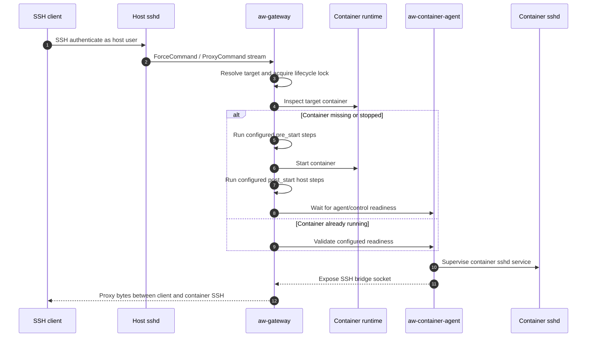
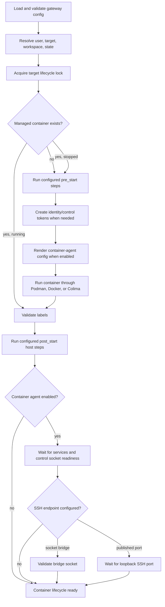
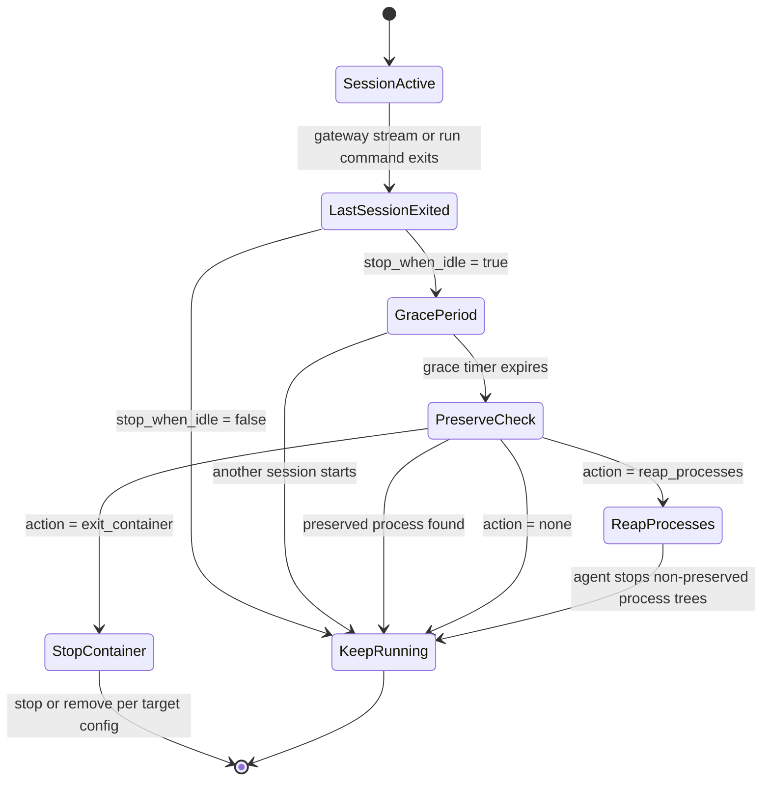
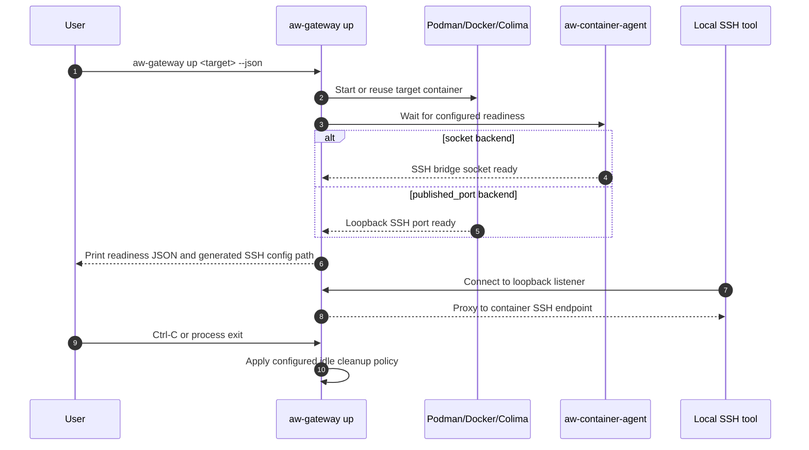

# Agent Workspaces Gateway

`aw-gateway` is a convenience utility for managing disposable or reusable
container workspaces. Users can work normally inside the workspace, while
operators keep the host filesystem out of reach and attach policy hooks around
the container, especially at the container network layer.

The gateway uses SSH as the standard interface into those sandboxes. It starts
or reuses a configured container, supervises required in-container services,
and connects SSH/SCP/SFTP clients to container-local SSH instead of to the host
shell or host filesystem.

It is a standalone gateway for managed hosts and local workstation profiles
that use Podman, Docker, or Colima.

In this project, a target is a named container configuration: an image plus
its naming mode, identity, cleanup policy, and SSH settings. "Agent
Workspaces" is the descriptive name for these sandboxes; the `aw-` binaries
implement the gateway and in-container support processes.

## Why It Exists

The goal is to let development tools run with normal local freedom inside a
container while moving the security boundary to the sandbox edges. Site policy
can be expressed through configured lifecycle hooks, mounted bootstrap assets,
supervised services, and host or container network controls without hard-coding
those policies into the gateway binary.

This matters when code or tools running in the workspace are not fully trusted,
such as autonomous coding agents or untrusted build steps, and should feel like
a normal development box without reaching the host filesystem or unrestricted
network.

Standard development tools still need a familiar connection model. OpenSSH,
SCP, SFTP, and desktop tools like VS Code, Codex, and Claude Code all know how
to talk SSH, so `aw-gateway` provides an SSH bridge into the
sandbox. On managed hosts, host SSHD authenticates the user and starts
`aw-gateway`; the gateway prepares the target container, waits for required
services, and connects the client to the container-local SSH daemon through a
controlled bridge.

## Features

- Host-side SSH dispatch for interactive shells, direct commands, and gateway
  management actions.
- Container lifecycle management for fixed and ephemeral targets.
- Runtime support for Podman, Docker, and Colima.
- Config-driven lifecycle steps before container start and host steps after
  start, including health checks.
- In-container service supervision with dependency ordering, restart policy,
  service health checks, and graceful shutdown.
- Built-in Unix-socket bridge from the host workspace to container SSH.
- Generated SSH client configuration for SSH, SCP, and SFTP clients.
- Per-user default target selection.
- First-run identity-token generation and controlled forwarding to selected
  services.
- Optional idle cleanup that can stop a container or reap non-preserved
  processes after the last gateway session exits.
- Protocol-safe logging for SSH proxy modes and rotating JSON logs for
  diagnostics.

## Lifecycle Diagrams

### Managed SSH Attach

In managed-server mode, host SSH authenticates the user and then invokes the
gateway. The user's SSH client is ultimately connected to container-local SSH,
not to the host shell or host filesystem.



### Container Startup And Readiness

Custom deployment hooks are represented as configured lifecycle/host steps.
They can prepare storage, create workspaces, install firewall rules, or perform
site-specific setup, but the native gateway lifecycle remains the same.



### Session Exit, Grace Period, And Cleanup

Cleanup is target policy. A target can keep running, stop after the last
session, or ask the container agent to reap non-preserved processes. Preserve
processes such as `tmux` or `screen` can keep a container alive when configured.



### Local Workstation Listen Mode

Local mode does not require host SSHD. The gateway can start a target and bind a
loopback-only listener for local SSH-compatible tools. Docker and Colima can use
a published loopback container SSH port instead of a host-visible Unix socket.



## Binaries

This repository builds four binaries:

- `aw-gateway`: host-side CLI, SSH dispatcher, runtime lifecycle manager, and
  client-config generator.
- `aw-container-bootstrap`: optional in-container bootstrap entrypoint that
  prepares identity/state and then execs the agent.
- `aw-container-agent`: container-side supervisor, control socket, service
  manager, idle-cleanup agent, and SSH socket bridge.
- `aw-ssh-command-filter`: container-side SSHD `ForceCommand` helper used to
  enforce configurable legacy SCP policy without breaking shell command exec.

## Build

Run build and install commands from the cloned repository root. Building
requires a Rust toolchain with edition 2024 support, which means rustc 1.85 or
newer. Container-side binaries must be built for the Linux architecture used by
the target container.

```bash
cargo build --release
```

The binaries are:

```text
target/release/aw-gateway
target/release/aw-container-bootstrap
target/release/aw-container-agent
target/release/aw-ssh-command-filter
```

For managed deployments, `aw-gateway` is installed on the host.
Container-side binaries can either be installed in the target image or mounted
read-only through the bootstrap-mount mode.

Example host install:

```bash
sudo install -m 0755 target/release/aw-gateway /opt/aw-gateway/bin/aw-gateway
```

Example container-runtime artifact install:

```bash
install -m 0755 target/release/aw-container-bootstrap /opt/aw-gateway/runtime/linux/aw-container-bootstrap
install -m 0755 target/release/aw-container-agent /opt/aw-gateway/runtime/linux/aw-container-agent
install -m 0755 target/release/aw-ssh-command-filter /opt/aw-gateway/runtime/linux/aw-ssh-command-filter
```

## Configuration

Default config paths:

```text
/etc/aw-gateway/gateway.toml
/etc/aw-gateway/container-agent.toml
/etc/aw-gateway/container-bootstrap.toml
```

Generate sample configs:

```bash
aw-gateway config init /tmp/gateway.toml
aw-container-agent config init /tmp/container-agent.toml
```

Validate configs:

```bash
aw-gateway --config /tmp/gateway.toml config validate
aw-container-agent --config /tmp/container-agent.toml config validate
```

Config path and log level can be overridden with flags or environment
variables:

```text
AW_GATEWAY_CONFIG
AW_GATEWAY_LOG_LEVEL
AW_CONTAINER_AGENT_CONFIG
AW_CONTAINER_AGENT_LOG_LEVEL
AW_CONTAINER_BOOTSTRAP_CONFIG
```

`AW_GATEWAY_CONFIG` selects the host gateway config,
`AW_CONTAINER_AGENT_CONFIG` selects the in-container supervisor config, and
`AW_CONTAINER_BOOTSTRAP_CONFIG` selects the rendered bootstrap config consumed
by `aw-container-bootstrap`.

The canonical sample configs are:

```text
aw-gateway.sample.toml
container-agent.sample.toml
```

## Deployment Guides

- [Podman](docs/guides/podman.md): generic local workstation and remote SSH
  deployment patterns with a minimal Ubuntu image and copyable example configs.
- [Docker](docs/guides/docker.md): native Linux Docker local and remote SSH
  deployment patterns.
- [Colima](docs/guides/colima.md): macOS local Colima deployment pattern using
  Docker through a Colima profile.
- [Firewall Policy](docs/guides/firewall.md): optional host, container, or VM
  firewall hooks for egress control.
- [Proxy And CA Policy](docs/guides/proxy.md): optional proxy service, CA trust,
  session environment, and firewall redirect patterns.

## Gateway Config Shape

The gateway config defines the runtime, workspace paths, SSH dispatch behavior,
client config generation, container targets, host lifecycle steps, and embedded
container-agent policy.

Minimal runtime selection:

```toml
[runtime]
type = "podman" # podman, docker, or colima
```

Docker can use a specific Docker socket:

```toml
[runtime]
type = "docker"
docker_host = "unix:///var/run/docker.sock"
```

Colima is implemented through Docker and derives `DOCKER_HOST` from the Colima
profile:

```toml
[runtime]
type = "colima"
profile = "default"
```

Set `runtime.program` to use a specific runtime executable instead of looking
up the default `podman`, `docker`, or `colima` binary on `PATH`:

```toml
[runtime]
type = "podman"
program = "/usr/local/bin/podman"
```

Target example:

```toml
[targets.ubuntu-dev]
image = "ubuntu/dev"
mode = "fixed"
name = "{image_slug}"
stop_when_idle = true
remove_on_stop = false
```

Fixed targets reuse one named container across connections. Ephemeral targets
create a per-session container and require `mode = "ephemeral"`,
`ephemeral_name` with `{session_id}`, and `stop_when_idle = true` so idle
cleanup can remove each session container.

Podman managed-host targets default to the authenticated host user and home.
Docker and Colima targets default to `root` and `/root`; set
`container_user` and `container_home` when the image provides a different
account.

Target identity controls the user and numeric identity prepared inside the
container:

```toml
[targets.ubuntu-dev.identity]
bootstrap_user = "root"
session_user = "{user}"
session_uid = "{uid}"
session_gid = "{gid}"
session_home = "/home/{user}"
session_shell = "/bin/bash"
```

Gateway configs commonly include:

- `[workspace]`: host workspace path and per-workspace state directory.
- `[ssh_dispatch]`: which host SSH commands are handled by the gateway and
  whether container command passthrough is enabled.
- `[client_config]`: generated SSH alias templates, host name, gateway path,
  and default identity directory.
- `[targets.<name>]`: container image, naming mode, container user/home,
  cleanup behavior, optional runtime args, environment, and local-listen
  settings.
- `[targets.<name>.identity]`: container bootstrap and session identity
  fields.
- `[[lifecycle_steps]]`: phase-keyed host hooks for `pre_start`,
  `post_start_host`, `pre_stop`, and `post_stop`.
- `[[host_steps]]`: post-start host hooks that run after agent readiness, such
  as firewall setup, with optional command health checks.
- `[[container_mounts]]` and `[[targets.<name>.container_mounts]]`: extra
  host-to-container bind mounts, typically read-only bootstrap
  binaries/configs/certs.
- `[container_bootstrap]`: optional bootstrap entrypoint configuration and
  pre-agent container bootstrap steps. Targets may overlay
  `[targets.<name>.container_bootstrap]` field-by-field.
- `[[container_bootstrap_steps]]`: optional container-side setup commands that
  run after identity preparation and before the agent starts. Targets may
  replace, remove, append, or order steps with
  `[[targets.<name>.container_bootstrap_steps]]`.
- `[container_ssh.transfer]`: explicit container SSH file-transfer policy.
  Set `sftp = "deny"` to block SFTP and modern OpenSSH SCP. Set
  `legacy_scp = "deny"`, `"inbound"`, or `"outbound"` to control legacy
  `scp -t`/`scp -f` server mode through the container-side command filter.
  A target may replace the full transfer table with
  `[targets.<name>.container_ssh.transfer]`.
- `[container_agent]`: optional in-container supervision and SSH bridge
  support.
- `[[container_agent.services]]`: in-container services supervised by
  `aw-container-agent`.
- `[container_agent.ssh_bridge]`: Unix socket bridge to container SSH.

Target-specific runtime and environment knobs are explicit:

```toml
[targets.default.runtime]
extra_run_args = ["--cap-add", "SYS_ADMIN"]

[targets.default.container_env]
CODEX_HOME = "/var/lib/codex"

[targets.default.session_env]
CODEX_HOME = "/var/lib/codex"
```

`container_env` is passed when the long-lived container is created.
`session_env` is used for gateway-managed command execution and is rendered
into the generated SSHD session environment snippet consumed by the example
container SSH helper.

Container SSH transfer policy is independent for SFTP and legacy SCP:

```toml
[container_ssh.transfer]
sftp = "allow"        # allow | deny
legacy_scp = "allow"  # allow | deny | inbound | outbound
```

Target transfer policy replaces the full global transfer table for that
target, so every transfer field must be specified:

```toml
[targets.internal.container_ssh.transfer]
sftp = "deny"
legacy_scp = "outbound"
```

Global lifecycle, host, and bootstrap step lists are inherited by every target.
Target entries use the same key as the global list (`phase + name` for
`lifecycle_steps`, `name` for `host_steps` and `container_bootstrap_steps`).
A same-key target entry replaces the inherited entry in place, while
`enabled = false` removes an inherited entry. New target-only entries append by
default and can specify one of `before = "name"` or `after = "name"`; lifecycle
ordering references are resolved only within the same phase.

Use `lifecycle_steps` for host hooks tied to a lifecycle phase, including stop
and teardown phases. Use `host_steps` for post-start checks and setup that
should run after the container agent is ready and can report readiness.

When `sftp = "deny"`, `start-container-sshd` removes the SFTP subsystem from
the runtime SSHD config. Modern OpenSSH SCP uses SFTP, so that blocks both.
When `legacy_scp` is not `"allow"`, the helper adds a container-side
`ForceCommand` that runs `aw-ssh-command-filter`. Legacy SCP inbound means
upload into the container (`scp -t`); outbound means download from the
container (`scp -f`). SFTP has only allow/deny because the SFTP subsystem is a
bidirectional protocol channel rather than separate upload/download server
commands.

`container_ssh.transfer` only applies to traffic that traverses the container
SSHD. Gateway actions such as `run` execute through the host container runtime,
so they do not pass through the container SSHD `ForceCommand` and are not
controlled by SFTP/SCP transfer policy. Host-gateway SSH dispatch checks the
global transfer table before dispatch; per-target transfer overrides apply to
direct container-SSHD access. If a deployment intends to expose management-only
SSH commands without arbitrary container exec, omit `run` from
`ssh_dispatch.enabled_gateway_actions`; also omit `connect` if users should not
receive a full container SSH session. `allow_container_commands = false` blocks
non-gateway passthrough commands, but it does not disable explicitly enabled
gateway actions.

## Container Agent Services

When `container_agent.enabled = true`, the gateway renders the embedded
`[container_agent]` policy into the container state directory. By default it
starts `aw-container-agent` as the container entrypoint. If
`container_bootstrap.enabled = true`, it starts `aw-container-bootstrap`
instead; bootstrap prepares passwd/group/home/state, runs configured bootstrap
steps, and then execs `aw-container-agent` so the agent becomes PID 1. When the
agent is disabled, the gateway can still manage container lifecycle and
`run/status/stop`, but SSH proxying and supervised services are unavailable
unless the target uses a separate configured mechanism.

The container agent supervises configured services, exposes the SSH bridge, and
answers gateway control requests over a private Unix-domain control socket.
Disabling the control socket is useful for published-port SSH backends, but it
also removes agent-control readiness and mutating control requests through that
socket.

Service example:

```toml
[[container_agent.services]]
name = "container-sshd"
required = true
user = "root"
command = ["/usr/local/bin/start-container-sshd"]
restart = "always"
depends_on = ["acl-proxy"]

[container_agent.services.health_check]
type = "tcp"
host = "127.0.0.1"
port = 22
interval = "2s"
timeout = "1s"
```

Supported service health checks include process, TCP, and HTTP checks. HTTP
checks can require status codes and top-level JSON field matches.

Services do not inherit sensitive gateway environment by default. A service
receives values such as `AW_IDENTITY_TOKEN` only when explicitly configured in
the service `env` table:

```toml
[container_agent.services.env]
AW_IDENTITY_TOKEN = { inherit = "AW_IDENTITY_TOKEN" }
STATIC_VALUE = { value = "example" }
FROM_FILE = { file = "/run/secrets/example", required = false }
```

Service env entries can use literal `value`, inherit from the agent
environment, or read a file.

## SSH Workflows

On a managed host, OpenSSH authenticates the user and invokes `aw-gateway` with
`ForceCommand`. The user's normal login shell should remain a standard shell
such as `/bin/bash`; the gateway handles command dispatch.

`ForceCommand` makes host SSHD run the gateway instead of the user's shell for
matched accounts. SSHD passes the requested command in `SSH_ORIGINAL_COMMAND`,
which the gateway parses as a management action or container command.
Generated client config uses `ProxyCommand` so workstation SSH tools can
tunnel through the authenticated host connection to container SSH.

Example SSHD match block:

```sshconfig
Match Group aw-gateway-users
    ForceCommand /opt/aw-gateway/bin/aw-gateway --config /etc/aw-gateway/gateway.toml
    PermitTTY yes
    AllowTcpForwarding no
    AllowStreamLocalForwarding no
    PermitTunnel no
    X11Forwarding no
    AllowAgentForwarding no
```

The default config path is `/etc/aw-gateway/gateway.toml`. Deployments can use
that path directly or pass `--config`/`AW_GATEWAY_CONFIG` when an explicit
override is preferred.

Typical user actions through host SSH:

```bash
ssh user@host
ssh user@host status
ssh user@host set-default fedora-dev
ssh user@host show-default
ssh user@host reset-default
ssh user@host stop
ssh user@host remove internal-ubuntu-dev
ssh user@host rm internal-ubuntu-dev
ssh user@host 'git status'
```

For direct SSH/SCP/SFTP/VS Code access to the container SSH daemon, generate
client config:

```bash
cat ~/.ssh/id_rsa.pub | ssh user@host 'add-container-key ubuntu-dev --public-key -'
ssh user@host 'client-config ubuntu-dev'
```

The first command appends the workstation public key to the container
authorized-key file under workspace state. The second prints SSH config for the
container route. The generated config intentionally omits `User` and
`IdentityFile`; keep those in your normal local SSH config when needed.
`client-config` only prints config and does not create key material or modify
authorized keys.

Install the generated config by redirecting it into a file included by your
local SSH config, or pass it explicitly with `ssh -F`:

```bash
ssh user@host 'client-config ubuntu-dev' > ~/.ssh/config.d/aw-gateway
ssh -F ~/.ssh/config.d/aw-gateway aw-ubuntu-dev
```

If an operator explicitly wants gateway-managed inner key material, generate a
managed key bundle:

```bash
ssh user@host 'client-bundle ubuntu-dev'
```

Managed-server client config uses `ProxyCommand` to route the workstation's SSH
client through the authenticated host connection and into the container SSH
bridge.

## Local Workstation Mode

Local profiles can use the same gateway binary without host SSHD. A target can
enable a loopback-only listener:

```toml
[targets.default.local_ssh]
mode = "listen"
backend = "socket"
readiness = "agent_control"
host = "127.0.0.1"
```

Docker and Colima profiles can use a published loopback port as the gateway's
backend for container SSH:

```toml
[targets.default.local_ssh]
mode = "listen"
backend = "published_port"
readiness = "ssh_only"
host = "127.0.0.1"

[container_agent]
enabled = true
control_socket = false
```

Use `control_socket = false` when the host gateway only needs the published
SSH port. This lets `aw-container-agent` supervise services without creating an
unused Unix socket on a Docker/Colima bind mount.

Common `local_ssh` options:

| Field | Values | Purpose |
| --- | --- | --- |
| `mode` | `proxy_command`, `listen` | Generate `ProxyCommand` client config or bind a loopback gateway listener. |
| `backend` | `socket`, `published_port` | Connect to the container agent SSH bridge socket or to a runtime-published SSH port. |
| `readiness` | `agent_control`, `ssh_only` | Wait for the agent control socket or only for SSH reachability. |
| `host` | IP address | Listener bind address, normally `127.0.0.1`. |

In this mode the SSH client still talks to the gateway listener. Docker's
published port is an internal backend hop:

```text
ssh client -> aw-gateway local listener -> Docker published port -> container:22
```

Start the target and emit connection details:

```bash
aw-gateway --config ./gateway.local.toml up default --json
```

The generated SSH config is written under the workspace state directory and can
be used by SSH-compatible tools.

## CLI

```text
aw-gateway [--config PATH] [--log-level LEVEL] <command>
```

Global options:

- `--config PATH`: gateway config path. Also available as
  `AW_GATEWAY_CONFIG`.
- `--log-level LEVEL`: override configured gateway log level. Also available
  as `AW_GATEWAY_LOG_LEVEL`.
- `-h, --help`: print help.
- `-V, --version`: print version.

Gateway commands:

```text
config validate
config init [path] [--force]
connect [target]
up [target] [--json] [--session-id ID]
run [target] [--cwd DIR] -- <command> [args...]
stop [target] [--session-id ID]
remove [target]
status [target] [--json] [--session-id ID]
status --all [--json]
targets [--json]
set-default [target-or-image] [--reset]
add-key [target] [--public-key PATH|-]
add-host-key [--public-key PATH|-]
add-container-key [target] [--public-key PATH|-]
help
client-config [target] [--identity-file PATH]
client-bundle [target] [--identity-file PATH] [--rotate-key]
```

A session is one gateway connection or invocation tracked for lifecycle and
idle cleanup decisions. Fixed targets usually let the gateway generate session
IDs automatically. Ephemeral targets can use `--session-id` when another tool
needs to correlate `up`, `status`, or `stop` with the same per-session
container.

Gateway command behavior:

- `config validate`: load and validate the gateway config.
- `config init [path] [--force]`: write the embedded sample gateway config.
- `connect [target]`: start or reuse a target and proxy the current SSH stream
  to the container SSH bridge.
- `up [target] [--json] [--session-id ID]`: start or reuse a target and report
  readiness. Local-listen targets keep the listener alive until interrupted.
- `run [target] [--cwd DIR] -- <command> [args...]`: start or reuse a target
  and run one command inside the container. A command is required; use `up` to
  start or hold a target without running a command.
- `stop [target] [--session-id ID]`: stop a target, or a specific ephemeral
  session target.
- `remove [target]`: stop a fixed target if needed, then remove its existing
  container so the next start recreates it from the current config.
- `status [target] [--json] [--session-id ID]`: report one
  configured/default target's container state.
- `status --all [--json]`: list existing `aw-gateway`-managed containers for
  the current user from runtime labels. This omits configured targets that have
  never created a container and omits unrelated or unlabeled containers.
- `targets [--json]`: list configured targets without starting or inspecting
  containers.
- `set-default <target-or-image>`: set the user's default target.
- `set-default --reset`: clear the user's default and fall back to the
  configured default.
- `add-key [target]`: add one SSH public key to both the user's host
  `~/.ssh/authorized_keys` file and the target container authorized-key file.
- `add-host-key`: add one SSH public key to the user's host
  `~/.ssh/authorized_keys` file.
- `add-container-key [target]`: add one SSH public key to the target container
  authorized-key file.
- `help`: print the restricted SSH command summary. This is separate from CLI
  `--help` so it can be safely exposed through SSH dispatch.
- `client-config [target]`: generate SSH client configuration for direct
  container SSH/SCP/SFTP/VS Code access.
- `client-bundle [target]`: generate a gateway-managed inner private key and a
  self-contained SSH config bundle.

When invoked by OpenSSH `ForceCommand`, the gateway parses
`SSH_ORIGINAL_COMMAND` and exposes the restricted SSH command set. That set
uses the same command names for most actions, and also accepts SSH-oriented
actions and aliases such as `show-default`, `reset-default`, and `rm`. In the
native CLI, use `set-default --reset` to reset the default target and `remove`
to delete a fixed target container.

`add-key`, `add-host-key`, and `add-container-key` options:

- `--public-key PATH`: read exactly one SSH public key from a file.
- `--public-key -`: read exactly one SSH public key from stdin.
- Omitting `--public-key` prompts for one SSH public key on stdin.

`client-config` options:

- `--identity-file PATH`: use an explicit private key path in generated config.

`client-bundle` options:

- `--rotate-key`: rotate the managed inner SSH key before writing the bundle.
- `--identity-file PATH`: use an explicit private key path in the generated
  bundle config.

Container agent commands:

```text
aw-container-agent [--config PATH] [--log-level LEVEL] config validate
aw-container-agent [--config PATH] [--log-level LEVEL] config init [path] [--force]
aw-container-agent [--config PATH] [--log-level LEVEL] run
```

Container agent options:

- `--config PATH`: container-agent config path. Also available as
  `AW_CONTAINER_AGENT_CONFIG`.
- `--log-level LEVEL`: override configured container-agent log level. Also
  available as `AW_CONTAINER_AGENT_LOG_LEVEL`.
- `-h, --help`: print help.
- `-V, --version`: print version.

Container agent command behavior:

- `config validate`: load and validate the container-agent config.
- `config init [path] [--force]`: write the embedded sample container-agent
  config.
- `run`: start supervised services, control socket, SSH bridge, and cleanup
  loop according to config.

Container bootstrap invocation:

```text
aw-container-bootstrap [--config PATH] [--bootstrap-config PATH] [--log-level LEVEL]
```

Container bootstrap options:

- `--config PATH`: container-agent config path passed through to the agent.
  Also available as `AW_CONTAINER_AGENT_CONFIG`.
- `--bootstrap-config PATH`: rendered bootstrap config path. Also available
  as `AW_CONTAINER_BOOTSTRAP_CONFIG`.
- `--log-level LEVEL`: override configured container-agent log level. Also
  available as `AW_CONTAINER_AGENT_LOG_LEVEL`.

`aw-container-bootstrap` is intended as a container entrypoint. It prepares the
container identity and configured bootstrap steps, then execs
`aw-container-agent`.

## Assets

The `assets/` directory contains deployable helpers and image files:

- `assets/aw-iptables`: applies, checks, and reports namespace-local proxy
  firewall rules for a running container PID.
- `assets/ensure-storage-conf`: creates a rootless Podman storage config for
  shared image storage on managed hosts. It takes explicit `--template`,
  `--shared-store`, and optional `--storage-conf` arguments.
- `assets/copy-skel`: copies top-level deployed skel files into a workspace
  without overwriting existing files. It takes explicit `--skel-dir` and
  `--workspace` arguments.
- `assets/sshd_config_agent`: container-local SSHD policy intended for gateway
  targets.
- `assets/start-container-sshd`: prepares `/run/sshd`, generates missing SSH
  host keys, renders transfer policy into a runtime SSHD config, validates it,
  and execs container `sshd`.

## Runtime Environment Contracts

The gateway and container agent coordinate through environment variables and
private state files:

- `AW_IDENTITY_TOKEN`: generated or inherited by the gateway and exposed only
  to services that explicitly request it.
- `AW_CONTAINER_CONTROL_TOKEN`: generated per container and passed only to the
  container agent for mutating control-socket requests.
- `AW_AUTHENTICATED_UID` and `AW_AUTHENTICATED_GID`: authenticated host user
  identity used by the container agent for peer validation and service-user
  handling.
- `AW_CONTAINER_STATE_DIR`: in-container state path for agent config, control
  socket, SSH bridge socket, logs, and session data.
- `AW_CONTAINER_AGENT_ALLOW_PROCESS_REAP=1`: enables actual process reaping;
  without it, reaping reports remain dry-run.
- `AW_SSHD_POLICY_CONFIG`: generated SSH transfer-policy file consumed by
  container SSHD helper scripts.
- `AW_SSHD_SETENV_CONFIG`: generated SSHD `SetEnv` snippet for configured
  session environment variables.

The SSHD helper also supports test/override hooks:
`AW_SSHD_BASE_CONFIG`, `AW_SSHD_RUNTIME_CONFIG`, `AW_SSHD_RUN_DIR`,
`AW_SSHD_DRY_RUN_CONFIG`, and `AW_SSH_COMMAND_FILTER`.

## Logging

Gateway and agent logs are configured in TOML:

```toml
[logging]
level = "info"
directory = "{state}/logs/gateway"
max_bytes = 104857600
max_files = 5
console = false
```

Protocol and proxy paths keep stdout quiet. Diagnostics go to stderr or the
configured log files. Gateway log directories can interpolate `{user}`, `{uid}`,
`{gid}`, `{home}`, `{workspace}`, `{state}`, and `{state_dir}`. Container-agent log
directories can interpolate `{container_state_dir}`. Container service
stdout/stderr is captured under the container state log directory with the
configured rotation limits.

## Development

```bash
cargo fmt --check
cargo test
cargo clippy --all-targets --all-features
cargo build --release
```

## Release

Releases are driven from `Cargo.toml`, `Cargo.lock`, and `CHANGELOG.md`.
`0.1.0` is the first release version for this repository.

For the first release, after the `Unreleased` changelog section is complete and
`main` is clean:

```bash
node scripts/release.mjs current
```

For later releases, use `patch`, `minor`, `major`, or an explicit semantic
version:

```bash
node scripts/release.mjs patch
node scripts/release.mjs minor
node scripts/release.mjs major
node scripts/release.mjs 0.2.3
```

The script stamps the changelog, commits `Release vX.Y.Z`, creates and pushes a
matching git tag, creates a GitHub prerelease with notes from the changelog,
then commits a fresh `Unreleased` section for the next cycle.

## Project Structure

- `src/bin/` - binary entrypoints.
- `src/config.rs` - TOML schema, defaults, validation, and sample config.
- `src/gateway.rs` and `src/gateway/` - host-side CLI behavior, runtime
  orchestration, sessions, listeners, identity, and client config.
- `src/agent.rs` - in-container service supervision and control socket.
- `src/runtime.rs` - Podman, Docker, and Colima command construction.
- `src/ssh_dispatch.rs` - `SSH_ORIGINAL_COMMAND` parsing and restricted SSH
  dispatch.
- `src/logging.rs` - tracing setup and rotating log files.
- `assets/` - deployable host helpers and image integration files.
- `tests/` - deterministic tests for config, CLI, runtime rendering, assets,
  SSH dispatch, and control socket behavior.
